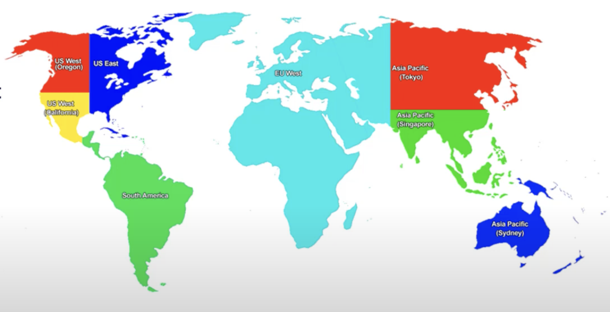
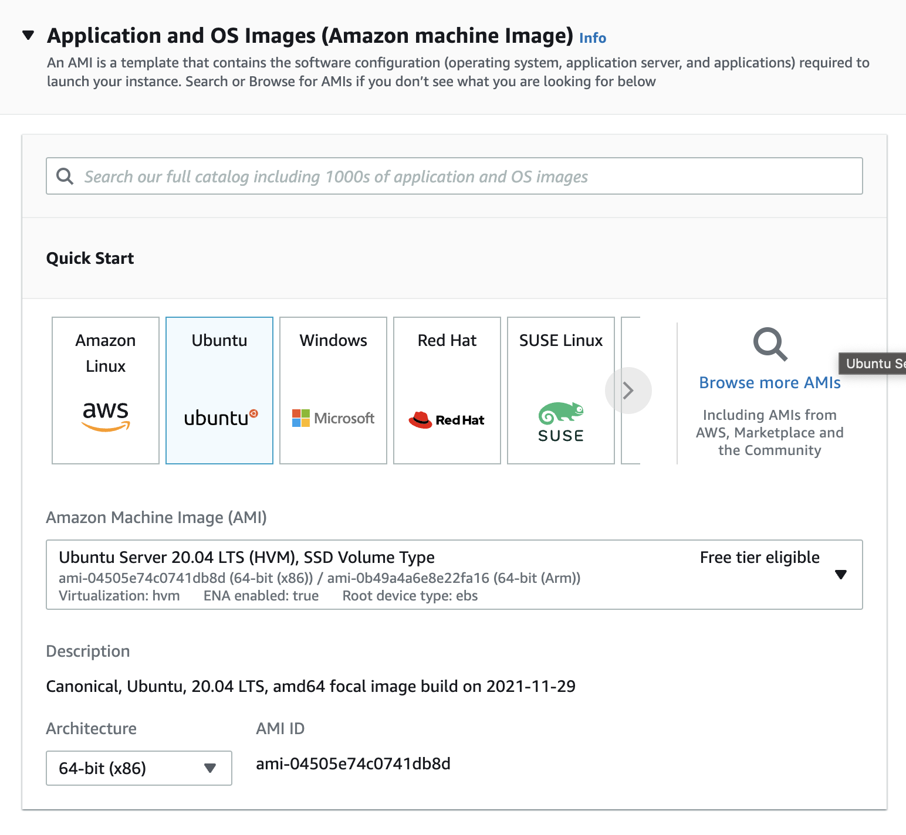
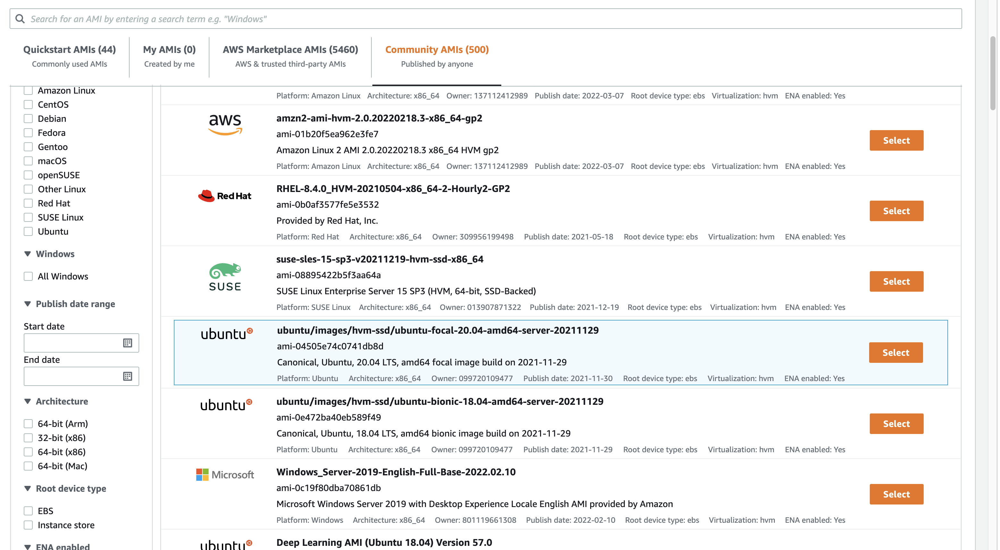
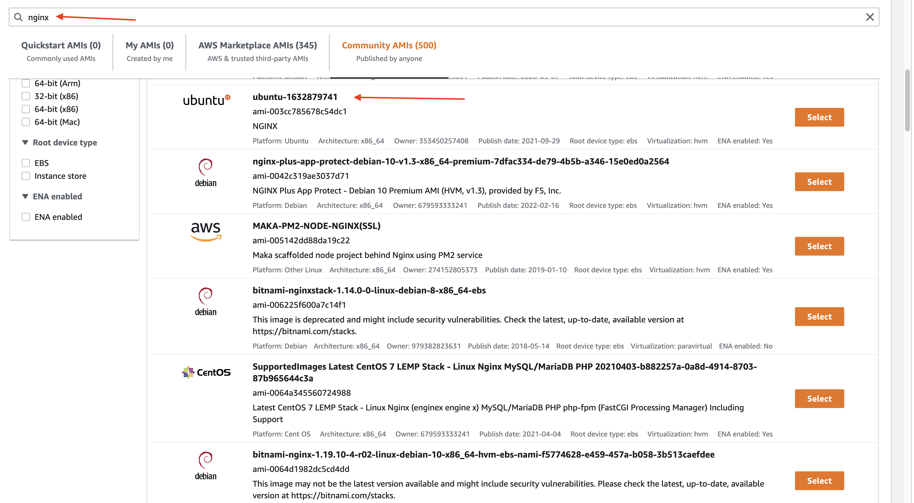
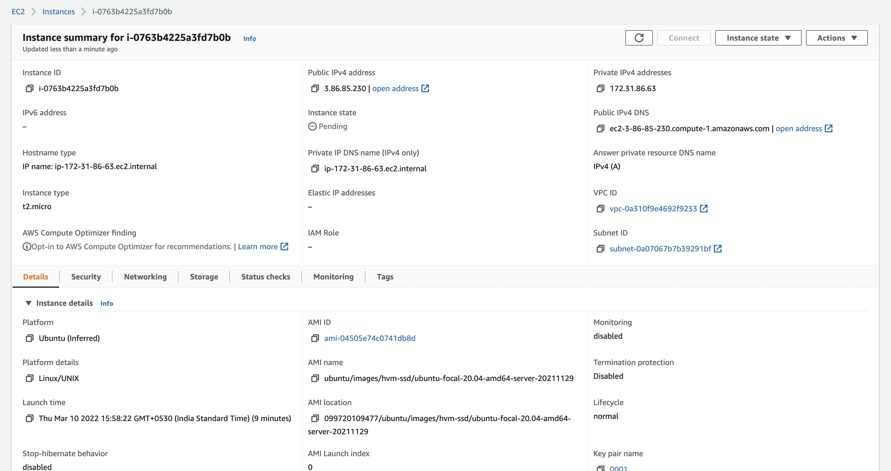
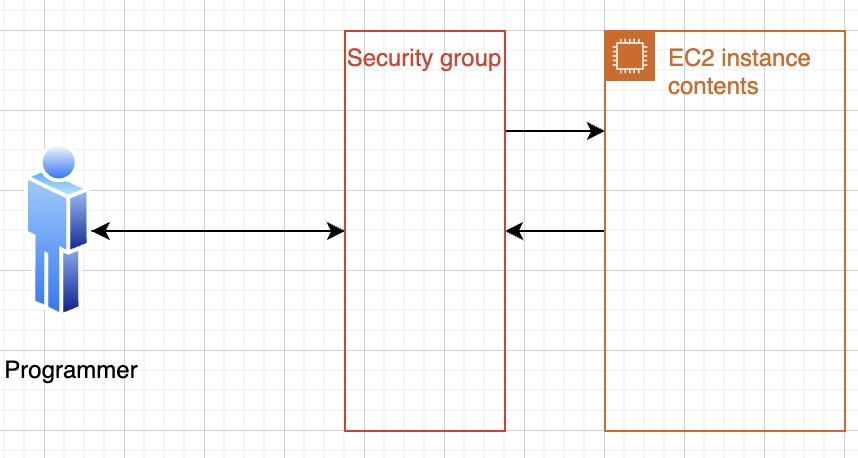

#### Root user :
1.  The password of the root user should be changed in timely basis.
2. Some of the billing can also be done only by the root user.

#### Regions :
**Why AWS have more regions?**
1. This is because the content reaches faster to you when the location is near by you.
2. Sometimes countries have restrictions; all the data should not go out of the country.
3. Taking care of natural disaster.

**Avaliability Zone (AZ) :**

AZ's are the <u>Data centers</u>.
1. The Regions are separated into multiple AZs
2. If one of the AZ goes down even then application can run properly.
<div align ="center">

</div>
#### On-premises

|On-premises|
|-----------|
|Application|
|Data       |
|Runtime    |
|Middleware |
|OS         |
|Virtulization|
|Server  |
|Storeage|
|Networking|

**SAAS :**

- We will only care about the service, and don't care how much RAM or CPU (hardware) is required. Eg: Netflix. 
- Here we don't care about anything.
- Here we are paying for the software.

**PAAS :**

- Example docker. We have to provide only the <u>**application and data**</u>, and we don't care about anything else.
- Here, we are paying for the Application and data to run.

**IAAS :**

- Example digtal ocean, They only give you till the virtualization, and we have to take care of the OS to application.

**AWS have some services which are global and region-scopes :**

- Example of Global : IAM, S3, CloudFront
- Example of region-scoped : Lambda

**Creating the EC2 images :**

1. <u>Create the amazon machine image (AMI):</u>

- Create the image.
- These images will have the custom
<div align ="center">

</div>

- When we have our own image (which is customize for the ML), then we can publish it in the **Community AMI**.

<div align ="center">

</div>

- When we want a unbuntu image with nginx. We can get it
- :point_down: Look into the red mark

<div align ="center">

</div>

2. <u>Choose the type of CPU</u>

- Here the AWS will not tell which Physical CPU it is.
- It is only the virtual CPU.
- With how many gigs it can process per sec.
- In production t2.2X large.

3. <u>Choose the volume</u>

- Using GP2 is the standard.

4. <u>Add Tags</u>

- This is for the reference,

5. <u>Download the SSH key.</u>

**Looking into the created machine :**

1. Private vs public availability zone:
- When two instance want to communicate with two instances private is faster than the public.

<div align ="center">

</div>


2. To connect it to the EC2. we can use **EC2 instance connect**
3. To access with personal computer we can use Terminal (I your Iterm 😎)

```
chmod 400 <pem_file_name>.pem

ssh -i "<pem_file_name>.pem" ubuntu@<public_ipaddess>
```
:point_up: Here, ubuntu is the user name.

<div align ="center">

</div>

For the security grop we can use add it. To connect it to the server using SSH then we have to use the port 22.

