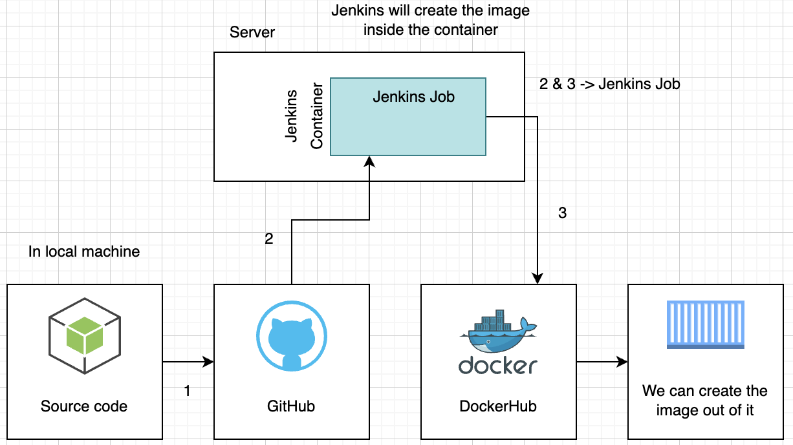

<div align="center">

</div>
#### <u>Jenkins</u>

- This is an automation software, to automate anything.
- Now days it is useful mostly in Continous Development and integration.

- Anyone can develop plugin for jenkins.

**For Example :**

- If the developer pushes the code to github.
- We can compile the code and move it to the development server.
- And the users can able to see the output immediately.

**Running jenkins in container :**
- To save all the config setting and extensions; we have to create a volume.

```
sudo docker run --rm --name myjenkins -d -v jenkins_home:/var/jenkins_home -p 8080:8080 -p 5000:5000 jenkins/jenkins:lts-jdk11
```

- Look into the logs to find the initail password.
- And install all the pre extensions
- create a login and complete the installation.

**Over view of the Jenkins :**
<div align="center">

</div>

- Create a basic Node app
- Create a Repo in github
- Pushed the sourc code in Github
- Create jenkins container on cloud or local server.
- Login to the jenkins control panel.
- Go to the 