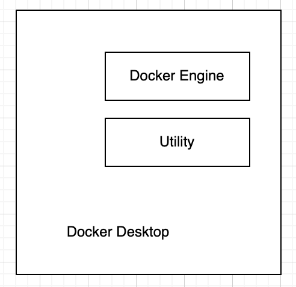
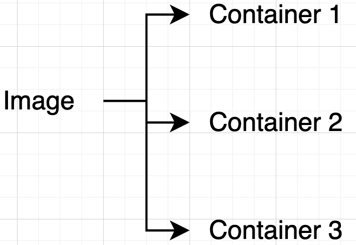
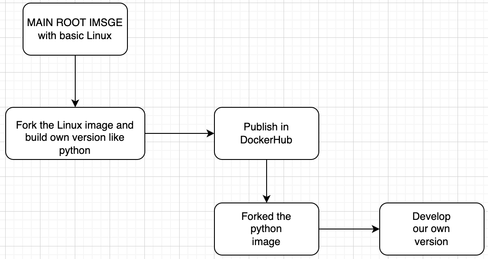
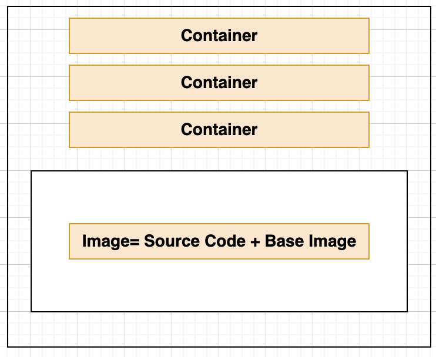
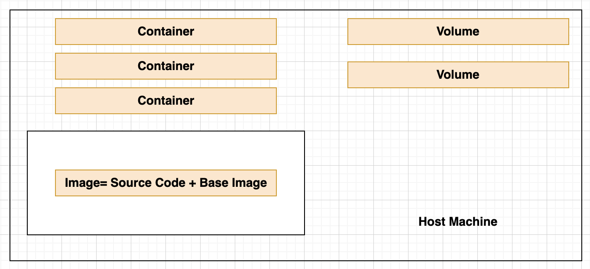
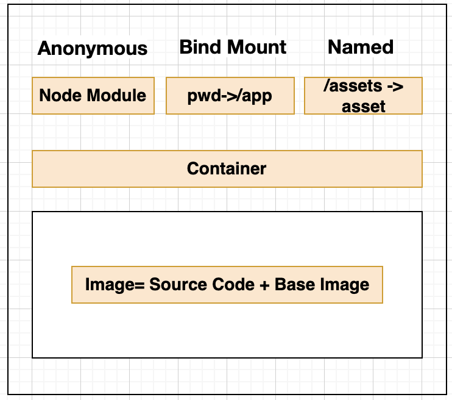

### Build and Deploy 💻  👉 🐳 :point_right: :cloud: :

**Problems 1:**
- When we develop an application in any programming language, the deployment becomes difficult as we use different compilers.

- Lets take the example for Amazon, while testing the Amazon the developer need to pay the money here we use a sandbox account. This should not be shiped to the actual environment. 

- So, we need package manager, build manager , environment manager.

- So, the USER -> DEVELOPS -> TEST -> APPROVE -> PRODUCTION -> NEW VERSIONS -> DEVELOP

- :point_up: This is called as **Pipe lines**

**Solutions :**
- Here, we used a methodlogy called as continous development and integration.

- To make this methodlogy happen we use different software called as Jenkins, Docker, Terraform, Selinium [E2E Test Tools].

- This operation is called as **Devops**

- The Devops evolve around -> TestOps, DevSecOps.

|Software   | Concept   | Containerization Solution Provider |
|-----------|-----------|------------------------------------|
|Docker     | Container | AWS Container, kubernates, GCP     |
|jenkins    |           |                                    |
|Kubernaties|           |                                    |

**Problem 2:**
- When the code moves from the DEVELOPER to TESTER then configuration of the system should be same.

**Solutions 1:**

- We create a container this have all the system configurations (like version of databasse or a version of softwares) 

- This can be done by the **Virtual Machine**.

- In windows, we use **Hypervisor**. Examples: vm ware, and virtual box. This is a hyper visor inbuilt called as Hyper-V. Hypervisor is a virualisation engine.

| App1   | App2    |
|--------|---------|
|Bin/Libs|Bins/Libs|
|Guest OS|Guest OS |
|    Hypervisor   ||
|     Host OS     ||

- In the End it is the Virtual Machine, It uses the RAM, CPU Core.
- This also requires Hardware like memory, CPU core for the Host OS also.

- **The problem with hypervisor is the hypervisor have the entire operating system in Guest OS along with its kernel, its hardware abstraction layer, its lib, and network card.**
- **These are required by the OS, but not by the application.**

- **This might be avilable in the host OS itself. But for the sake of CI/CD we have to use 2 different OS.**

- _Here the problem is waste of Hardware, and dependent libraries._
```
Application <-> Hyper visor -> [Host OS : Only the Hardware and processing hypervisor]
```
**Solution 2:**

- Use Containers.
- In containerization, only the lib is installed in the docker engine, but this will not take hardware and dependent lib.

```
Applications <-> Doker Engine <-> Host OS
```

| App1   | App2    |
|--------|---------|
|Bin/Libs|Bins/Libs|
|Guest OS|Guest OS |
|    Docker Engine||
|     Host OS     ||


### Installation:

- In a standard way we can use the docker engine for Windows and MacOS.
- So, we have to install Docker desktop (Run time environment) as a daemon service, this runs Docker engine and utilies.

- In mac os,
```
doker verion
```
in terminal, this will show need to run daemon service.
<div align="center">

</div>
- But we dont need Desktop for Linux.

### What is image:
- Image is a read only bundle of a software, though which we can create the software.
### Docker hub and installing the images: 

- Login to the service.
- Here we can install the image of the service.

- For example if we want to install the node.js
```
sudo docker run node
(or)
sudo pull node
```
- :point_up: **This will check the internally the node.js is installed if so it will take the local image only** else it will go to the docker hub and intall node.js.
- We only downloaded the bundle, We have not created the software.

```
sudo docker images
```
- :point_up: This will show all the images. :point_down: This shows

|Repository|TAG    |IMAGES ID | CREATED     | SIZE |
|----------|-------|----------|-------------|------|
|node      |latest |36fad710..|21 hours ago |991MB |


**Why the size is so big?**

- This also have the light weight Linux operating system.

### Creating the container:

- **With one image we can create N- number of containers.**

- Always we need the images to run the container.

- Container will not take any memeory.

- The OS and Node.js (in this case) is in the image file only.

<div align="center">


</div>

```
sudo docker run node
```

- :point_up: This will **create a container**, When we run for one time it will create 1 container, when we run for 2nd time it will create a 2nd container.

To see all the running containers
```
sudo docker ps
```
- :point_up: This will show all the running containers.
- Here, we cant find node this is beacuse, node get run and exited.

To see the exited container also:
```
sudo docker ps -a
```
- This will show all the exited containers also.

|CONTAINER ID|IMAGE    |COMMAND   | CREATED     | STATUS |  PORTS  | NAMES              |
|------------|---------|----------|-------------|--------|---------|--------------------|
|<SHA 256 ID>|node     |          |4 mins       |EXITED  |         | priceless_varamitra|

- When we created the container this will not take any memory.

|CONTAINER ID| This is a SHA id which is given to every container    |
|------------|-------------------------------------------------------|
|NAMES       | User readable name which is unique for every container|

To remove a container:

```
sudo docker rm <container_id or names>
```

To remove all the unknown images:
```
sudo docker images prune
```
:point_up: prune will remove all the unknown images, networks, and containers

To open the file in the interactive mode:

```
sudo docker run -i -t node


sudo docker run --name fm --rm -d -p 3000:3000 filemanager:1.0
```
i -> Interactive

t -> Terminal

To stop the container
```
docker stop <container_name or container_SHA256>
```
### Creating the images:

- We can't create a empty image.
- We can create a image with the base image.

### Create a Dockerfile 

- and paste the code 
```
FROM node
```
- In the terminal 

```
sudo docker build .
```

- :point_up: This will buld our own image with respect to node.

### Building node.js application and making the container.

:point_down: This will create a MYAPP dir in the root directory. Note: Here "." - current app.

```
# This is in the dockerfile

FROM node:12.22

WORKDIR /MYAPP

COPY ./package.json .

RUN npm install

COPY index.js .

EXPOSE 3000

CMD["node","index.js"]
```


Node JS Note: 
- Here we don't have to install npm this comes with the node itself.
- By default all ports are closed.
- Here, the version is 12.22

To run the code in port 3000 while starting, we have to map the port in docker machine to the host machine.

```
sudo docker run -p 3000:3000 <container_name or container_SHA256>

# What it means:

sudo docker run -p <Host port>:<Docker port> <container_name or container_SHA256>

# To run the code in port 4000, then

sudo docker run -p 4000:3000 <container_name or container_SHA256>
```

**Commands**

| Command                        |                                      |
|--------------------------------|--------------------------------------|
|COPY {scr dir} {destination dir}|                                      |
| RUN {what you wanna run}       |                                      |
|CMD["node","index.js]           | CMD works when we start the container|

==**To give the name :** {IMPORTANT TO NOTE}==
```
sudo docker build -t <image_name>:<image_tag_name> .
```

**Trouble-shoot :**

- When we have to name the image, the image should be in small letters.

We can also give the name for the python

```
sudo docker run -it --name mypythoncontainer1 mypython1:v1

# This means

sudo docker run -it --name <name_of_the_container> <image_name>:<image_tag_name>
```

**Trouble-shoot :**

- When the images is not found in the localhost; this means we missspelled the image name

**Attach mode and detach mode :**

- When we run the above commands this will run in attach mode.
- To run in background we can use detatch mode.
- "-d" flag will run the code in detach mode.
- "-a" flag will run the code in atach mode.
```
sudo docker run -d --name <name_of_the_container> <image_name>:<image_tag_name>
```

- We will use the attached mode to see the logs.

**Logs genereated by the attached mode :**
```
docker logs <docker_name>
```

**Teminology :**

Dockerfile :
- Configuration which defines the expected destination configuration
- Environment details
- Source code or complied code.

Image :
- Compiled data from the configuration file as a source for each deployment.

Container :
- Final Box, Contianer where the program will actually run on ANY HOST.


<div align="center">

</div>

### DockerHub

NOTE: The name of the local and remote repository should be same.

**To login to the dockerhub**
```
sudo docker login
```
**The name should include / from the remote repo**
```
sudo docker push <remote repo name>:<tag_name>
```
### Getting into the container:
```
sudo docker run -it --name <container_name> <image_name>:<image_tag> bash
```

This will open the terminal inside the container. all the changes which were made inside the container will not affect the image, If we gonna create a new container everything will be gone. This is because the image is read only (once the image is created its created).

exit to get out of the container shell.
```
exit
```

#### <u>Docker Volumes</u>

- Containers are built on the top of the container. In the container we can download the 'nano'. That is the reason we have to delete all the containers before Image.
- All containers sit on the top of the Images.
- Image is also a collection of layers inside the image.

<div align="center">

</div>

We have to store the data in the container:

Different typed of data:

1. **Source code data** 
    - This is typically stored in the image.

2. **Temporary data**  
    - Cache file, user uploaded images, assests.
    - These are the data which we dont care even it is removed.

3. **Permanent Storeage like Database Files**
    - When the container get crashed then the data will be lost.
    - Persistent storeage [Continously store the data in the HD and the HD should be consistent].

**Solution :**

**Volume :**
- Volume is the external folder in the host machine. This is because the data stored in the volumne will not be deleted even when the container gets deleted.

<div align="center">

</div>


There are three type of volums:
1. **Anonymous Volume :**

    - This type of volumne removed as soon as the container removed.
    - This is used to store the temporary data.
    - In the dockerfile : <code>VOLUME ["/app/assets"]</code>

2. **Named Volume :**
    - <code>docker run --name <container_name>  --rm -v assets:/app/assets -d -p 3000:3000 <Image_name>:<image_version></code>
    - Named volume can't be created in dockerfile.

3. **Bind Mounts :**
    
**Concept :**
- The concept is- When there is a change in source folder it changes the symlink folder created in the container. But the reverse is not possible.
```
docker run --name <container_name> --rm
    -v assets:/app/assets
    -v ${pwd}:/app
    -v /app/node_modules/
    -d -p 3000:3000 <image_name>:<image_version>

```

- When there is longest path that volume will not be affected by the small path. 
- This is used to not to create unnessary images.

- Here we use -v flag. 

1st Volume -> Is the named volume.

2nd Volume -> Is the Bind Mount volume.

3rd Vloume -> Anonymous volume.
<div align="center">

</div>

---

To show all the volums
```
sudo docker volume ls
```