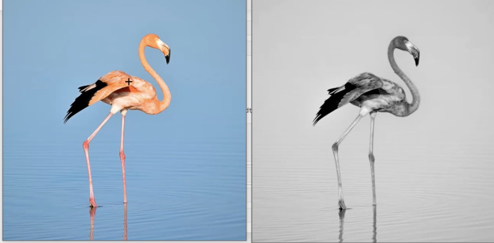

### What is a image:

- Image is a big matrix with x rows and y columns.
- If we do arithmetic operations with the matrix we get another matrix called as the image effect.
- Image processing is all about doing arthmetic operations on the image

#### OpenCV 

```
import cv2
```

To read the image:

```
img= cv2.imread('./flemingo.jpg')
```


:point_down: This will print the image in 3-D matrix.
```
print(img)

[[[188 163 119]
  [189 164 120]
  [189 164 120]
  ...
  [188 163 119]
  [188 163 119]
  [188 163 119]]

 [[188 163 119]
  [189 164 120]
  [189 164 120]
  ...
  [188 163 119]
  [188 163 119]
  [188 163 119]]

 [[188 163 119]
  [189 164 120]
  [189 164 120]
  ...
  [188 163 119]
  [188 163 119]
  [188 163 119]]

 ...

 [[167 134  88]
  [167 134  88]
  [167 134  88]
  ...
  [177 144  98]
  [177 144  98]
  [177 144  98]]

 [[171 141  94]
  [171 141  94]
  [172 142  95]
  ...
  [177 144  98]
  [177 144  98]
  [177 144  98]]

 [[177 147 100]
  [177 147 100]
  [178 148 101]
  ...
  [177 144  98]
  [177 144  98]
  [177 144  98]]]
```
:point_up: In this <code>[188 163 119]</code> This is one pixel. With blue, green, and red format. 


To rewrite the image:
```
cv2.imwrite('example.png',img)
```

To see all the blue; Here the light colors show the image in blue and the dark color shows the image in dark.
<div align ="center">

</div>
